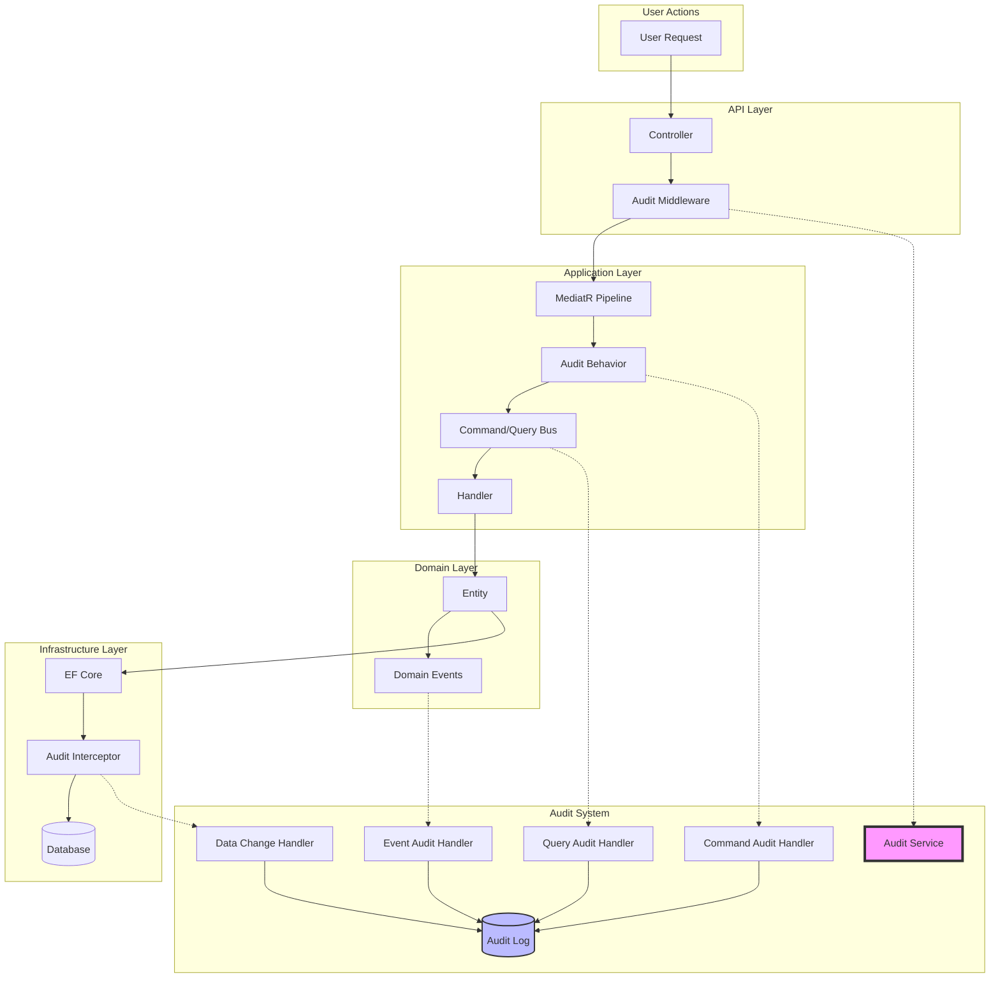
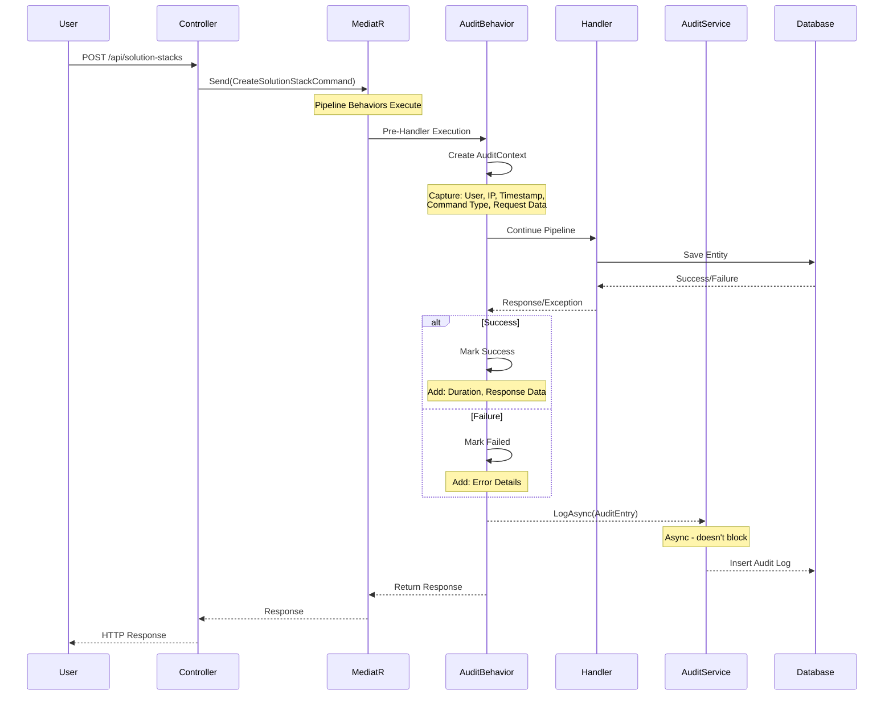
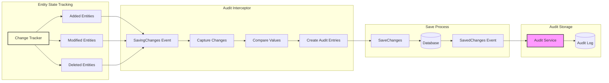
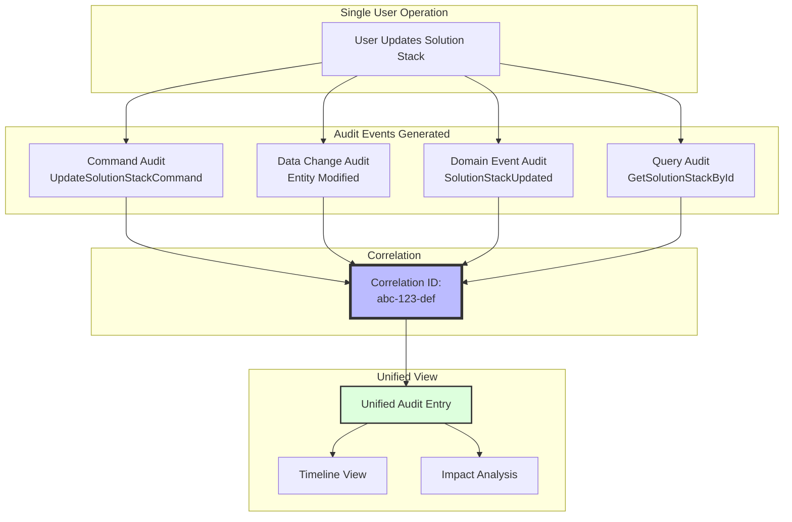
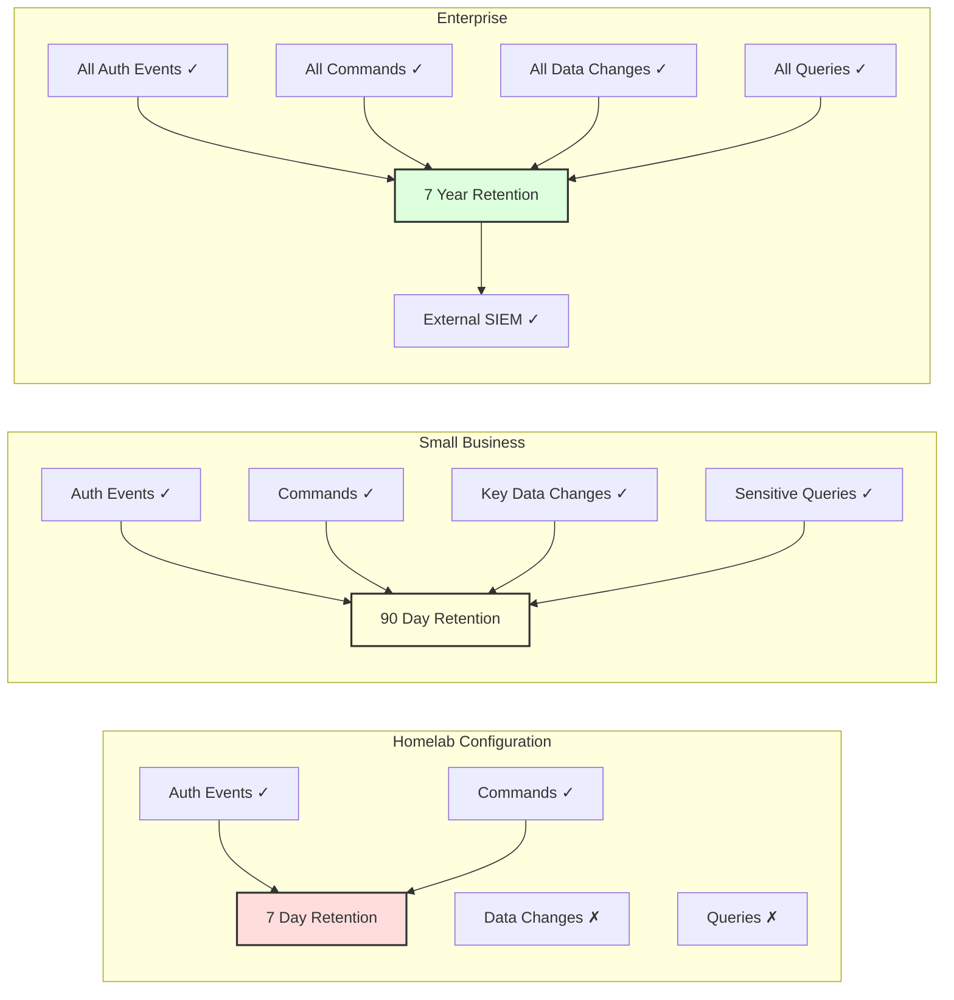
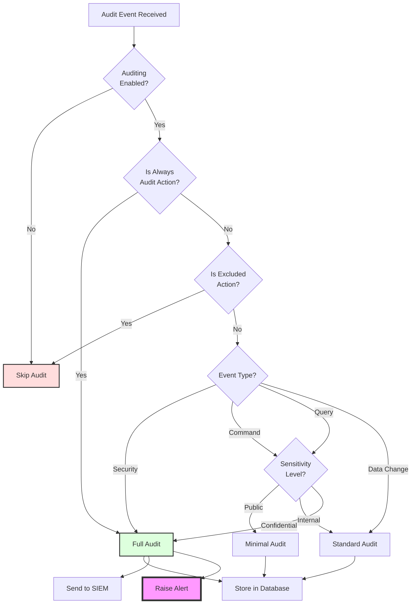
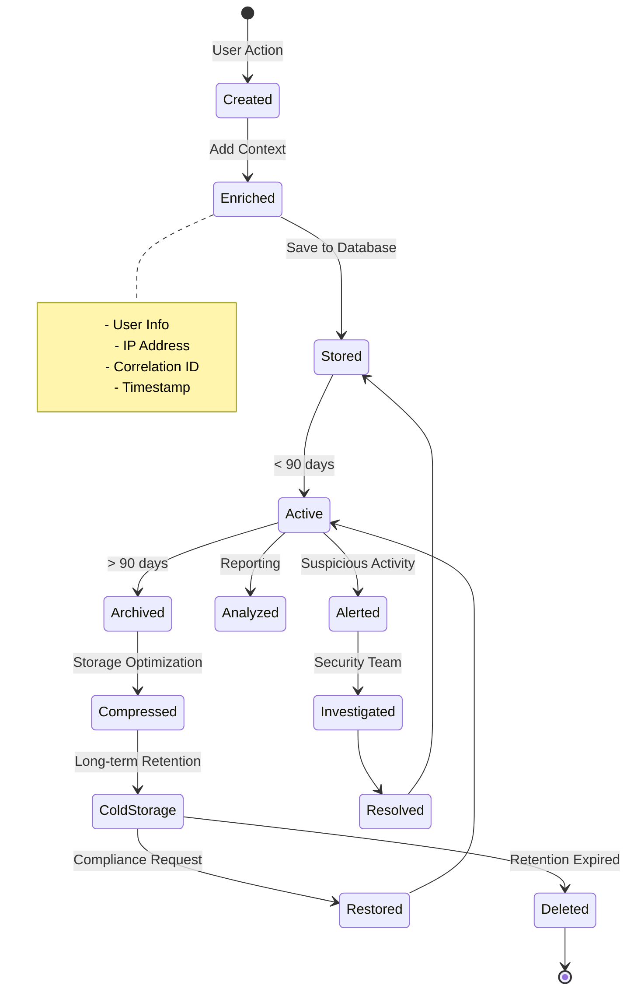
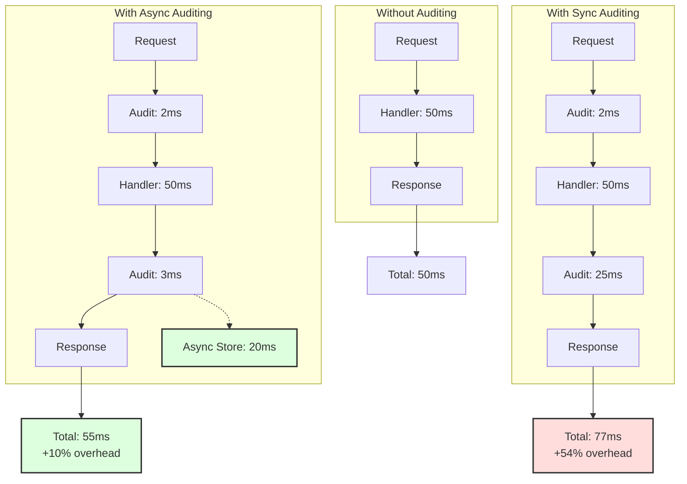

# Auditing Architecture

## Overview
The audit system implements a multi-layered approach to capture all system activity while maintaining performance and configurability.

## Core Components

### 1. MediatR Pipeline Behavior
- **Purpose**: Capture user intent through commands
- **When**: Pre and post command execution
- **What**: Command type, user, timestamp, success/failure

### 2. EF Core Interceptors
- **Purpose**: Track actual data changes
- **When**: During SaveChanges
- **What**: Entity changes, old/new values

### 3. Domain Event Auditing
- **Purpose**: Business-level events
- **When**: After domain events raised
- **What**: Event type, aggregate state

### 4. Query Auditing
- **Purpose**: Track data access
- **When**: During sensitive queries
- **What**: Query parameters, user, results count

## Configuration Levels

| Level | Homelab | Small Business | Enterprise |
|-------|---------|----------------|------------|
| Commands | ✓ | ✓ | ✓ |
| Data Changes | - | Key Only | All |
| Queries | - | Sensitive | All |
| Retention | 7 days | 90 days | 7 years |
| External SIEM | - | - | ✓ |

## Performance Considerations
- Async logging prevents blocking main operations
- Configurable detail levels reduce overhead
- Batch processing for high-volume scenarios
- Separate read models for audit queries

## Compliance Features
- Immutable audit records
- Cryptographic signatures (optional)
- Automated retention policies
- Export capabilities for external systems

## Overall Audit Architecture

## Command Audit FLow with MediatR Pipeline

## Entity Framework Core Change Tracking Audit

## Unified Audit Trail Correlation

## Deployment-Specific Audit Levels

## Audit Service Decision Flow

## Audit Data Lifecycle

## Performance Impact Visualization
