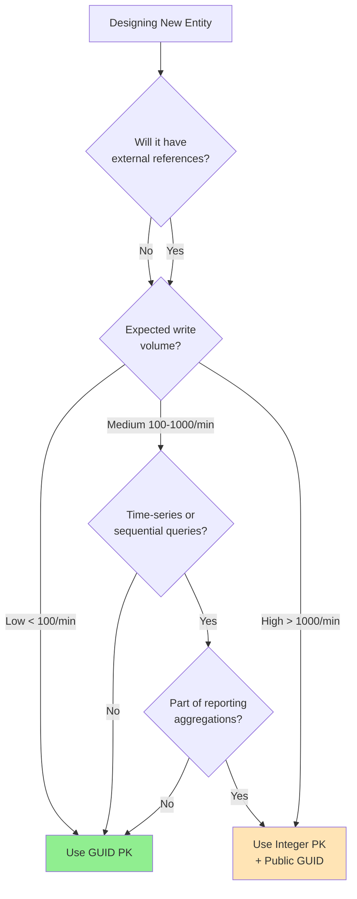

# Entity Design Guide

## Overview

This document provides guidance on choosing between GUID and Integer primary keys for entities in OpsPortal.
The decision impacts performance, scalability, and system design, but modern hardware and caching strategies have significantly reduced the performance differences between these approaches.

## Quick Decision Guide

## Best Practices

### DO ✅
- **Use GUIDs by default** - Simplicity and portability win
- **Add integer PKs only when measured performance requires it**
- **Always expose GUIDs in APIs** - Even for integer PK tables
- **Cache aggressively** - Eliminates most performance differences
- **Monitor actual performance** - Don't optimize prematurely

### DON'T ❌
- **Don't mix ID types in foreign keys** - Consistency matters
- **Don't expose integer IDs externally** - Security and portability issues
- **Don't optimize without measuring** - Profile first
- **Don't ignore write patterns** - They matter more than ID type

## Conclusion
For OpsPortal, **use GUIDs as primary keys for all entities except high-volume audit and metric tables.** The benefits of:

- **Simplicity** - One pattern for most entities
- **Portability** - Easy data migration and merging
- **External References** - Safe to expose in APIs
- **Distributed Systems** - No coordination required

Far outweigh the minimal performance impact, which can be mitigated through:

- **Modern hardware** - SSDs and RAM are cheap
- **Caching** - Keeps hot data in memory
- **Proper indexing** - Optimizes query patterns
- **Future optimization** - Can add integer columns if needed

Remember: **Premature optimization is the root of all evil.** Start simple with GUIDs, measure actual performance, and optimize only where data proves it's necessary.

## References
- [PostgreSQL UUID Performance](https://www.postgresql.org/docs/current/datatype-uuid.html)
- [SQL Server Sequential GUIDs](https://docs.microsoft.com/en-us/sql/t-sql/functions/newsequentialid-transact-sql)
- [Entity Framework Core Performance](https://docs.microsoft.com/en-us/ef/core/performance/)
