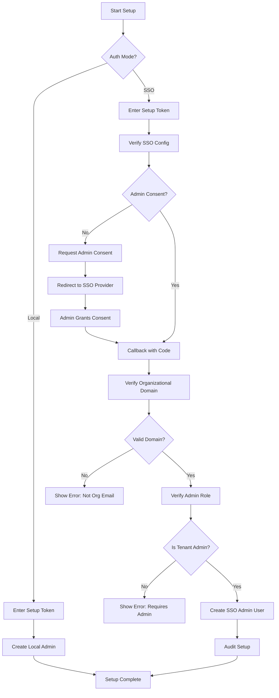

# OpsPortal Security Architecture

## Overview

OpsPortal implements a flexible security model that supports both local authentication for development/homelab environments and enterprise SSO for production deployments. The system enforces strict separation between authentication (who you are) and authorization (what you can do).

## Authentication Modes

### Local Authentication
- **Use Case**: Development, testing, and homelab deployments
- **Technology**: JWT tokens with BCrypt password hashing
- **Features**:
  - Username/password authentication
  - Configurable password policies
  - Account lockout protection
  - Refresh token support

### SSO Authentication
- **Use Case**: Enterprise production deployments
- **Supported Providers**: Azure AD/Entra ID (more providers planned)
- **Features**:
  - OpenID Connect/OAuth 2.0
  - Admin consent requirement
  - Domain verification
  - Just-In-Time (JIT) provisioning
  - Group-based role mapping

## Initial Setup Flow

The system implements a secure bootstrap process to handle initial configuration:



### Setup Token

The setup token is a one-time use token that:
1. Is generated on first application start
2. Is displayed in application logs or provided via environment variable
3. Expires after 30 minutes
4. Is deleted after successful setup
5. Cannot be regenerated without resetting the database

## Authorization Model

### Hybrid Approach

OpsPortal uses a hybrid authorization model:
- **Authentication**: Handled by the configured provider (local or SSO)
- **Authorization**: Always managed locally within OpsPortal

This approach provides several benefits:
1. **Provider Independence**: Switch SSO providers without losing permissions
2. **Fine-grained Control**: Override SSO groups with local permissions
3. **Audit Trail**: Complete history of permission changes
4. **Migration Support**: Easy transition between authentication providers

### Role Hierarchy

```
Admin
├── Full system access
├── User management
├── System configuration
└── All operator permissions

Operator
├── Manage solution stacks
├── Deploy applications
├── Configure monitoring
└── All viewer permissions

Viewer
├── Read all resources
├── View dashboards
├── Access reports
└── No modification rights
```

### SSO Group Mapping

SSO groups are mapped to local roles through configuration:

```json
{
  "SsoMappings": {
    "RoleMappings": [
      {
        "Provider": "AzureAd",
        "ExternalGroup": "OpsPortal-Admins",
        "LocalRole": "Admin",
        "Priority": 100
      },
      {
        "Provider": "AzureAd",
        "ExternalGroup": "OpsPortal-Operators",
        "LocalRole": "Operator",
        "Priority": 50
      }
    ]
  }
}
```

## Security Controls

### Shadow IT Prevention

For SSO deployments, the following controls prevent unauthorized instances:

1. **Admin Consent Required**: SSO setup requires tenant administrator approval
2. **Domain Verification**: Only organizational email domains are accepted
3. **Personal Email Blocking**: Common personal domains (gmail.com, etc.) are rejected
4. **Admin Role Verification**: Setup user must have admin rights in the SSO provider
5. **Audit Trail**: All setup attempts are logged with IP and timestamp

### Password Security (Local Auth)

- Minimum length: 12 characters
- Complexity requirements (uppercase, lowercase, digit, special)
- Password history (prevents reuse of last 5 passwords)
- Account lockout after 5 failed attempts
- Lockout duration: 15 minutes

### Token Security

- JWT tokens with configurable expiration (default: 60 minutes)
- Refresh tokens with longer expiration (default: 7 days)
- Tokens signed with strong secret key (minimum 32 characters)
- Refresh token rotation on use
- Token revocation support

### API Security

- All endpoints require authentication (except setup and health)
- Resource-based authorization for sensitive operations
- Rate limiting on authentication endpoints
- CORS configuration for web clients
- HTTPS required in production

## Compliance and Auditing

### Audit Events

The following events are audited:
- Initial setup completion
- User authentication (success/failure)
- Permission changes
- Role assignments
- Failed authorization attempts
- Admin consent grants (SSO)
- Token refresh/revocation

### Data Retention

- Audit logs: 90 days (configurable)
- Failed login attempts: 30 days
- Setup audit: Permanent

## Migration Strategy

### Local to SSO Migration (Future)

When migrating from local to SSO authentication:

1. **Export Phase**: Map local users to SSO identities
2. **Dual Mode**: Temporarily support both authentication methods
3. **Permission Migration**: Map local roles to SSO groups
4. **Cutover**: Switch to SSO-only mode
5. **Cleanup**: Archive local user data

## Security Best Practices

### Deployment Recommendations

1. **Production**:
   - Always use SSO authentication
   - Enable HTTPS with valid certificates
   - Configure firewall rules
   - Regular security updates
   - Monitor audit logs

2. **Development/Homelab**:
   - Local authentication acceptable
   - Strong setup token required
   - Change default passwords
   - Restrict network access

### Configuration Security

- Store secrets in environment variables or secret management systems
- Never commit credentials to source control
- Rotate JWT signing keys regularly
- Use strong, unique passwords for local accounts
- Regular review of role assignments

## Emergency Access

In case of SSO provider outage:
1. Maintain a break-glass local admin account (if policy allows)
2. Document recovery procedures
3. Test failover scenarios regularly
4. Keep audit trail of emergency access use

## Future Enhancements

Planned security improvements:
- [ ] Multi-factor authentication for local accounts
- [ ] Support for additional SSO providers (Okta, Auth0)
- [ ] API key authentication for service accounts
- [ ] Session management UI
- [ ] Security dashboard with metrics
- [ ] Automated security scanning