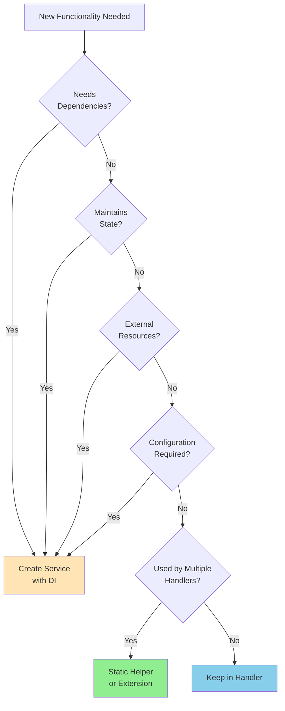

# Utilities vs Services Decision Guide

## Overview

In a CQRS architecture, it's important to distinguish between functionality that should be implemented as services (injected via DI) versus static utilities or extension methods. This guide helps developers make the right choice for OpsPortal.

## Quick Decision Flowchart



## When to Use Static Utilities

Static utilities are best for **pure functions** - operations that:
- Always return the same output for the same input
- Have no side effects
- Don't require external dependencies
- Don't need configuration

### Good Candidates for Static Utilities

#### String Manipulation
```csharp
public static class SlugGenerator
{
    public static string Generate(string input)
    {
        // Pure function - no dependencies needed
        return input.ToLowerInvariant()
            .Replace(" ", "-")
            .Replace("_", "-");
    }
}
```

#### Data Formatting
```csharp
public static class DateTimeFormatter
{
    public static string ToRelativeTime(DateTime dateTime)
    {
        var timeSpan = DateTime.UtcNow - dateTime;
        return timeSpan switch
        {
            { TotalMinutes: < 1 } => "just now",
            { TotalMinutes: < 60 } => $"{(int)timeSpan.TotalMinutes} minutes ago",
            { TotalHours: < 24 } => $"{(int)timeSpan.TotalHours} hours ago",
            _ => dateTime.ToString("MMM dd, yyyy")
        };
    }
}
```

#### Hash Generation
```csharp
public static class HashGenerator
{
    public static string GenerateSha256(string input)
    {
        using var sha256 = SHA256.Create();
        var bytes = sha256.ComputeHash(Encoding.UTF8.GetBytes(input));
        return Convert.ToBase64String(bytes);
    }
}
```

#### Validation Helpers
```csharp
public static class ValidationHelper
{
    public static bool IsValidEmail(string email)
    {
        return Regex.IsMatch(email, @"^[^@\s]+@[^@\s]+\.[^@\s]+$");
    }
    
    public static bool IsValidSlug(string slug)
    {
        return Regex.IsMatch(slug, @"^[a-z0-9]+(?:-[a-z0-9]+)*$");
    }
}
```

## When to Use Extension Methods

Extension methods are great for adding functionality to existing types in a fluent, discoverable way.

### Good Candidates for Extension Methods

```csharp
public static class StringExtensions
{
    public static string ToSlug(this string input)
    {
        return SlugGenerator.Generate(input);
    }
    
    public static string Truncate(this string input, int maxLength)
    {
        if (string.IsNullOrEmpty(input) || input.Length <= maxLength)
            return input;
        
        return $"{input.Substring(0, maxLength - 3)}...";
    }
}

public static class EnumExtensions
{
    public static string GetDisplayName(this Enum value)
    {
        var field = value.GetType().GetField(value.ToString());
        var attribute = field?.GetCustomAttribute<DisplayAttribute>();
        return attribute?.Name ?? value.ToString();
    }
}

public static class QueryableExtensions
{
    public static IQueryable<T> PageBy<T>(
        this IQueryable<T> query, 
        int pageNumber, 
        int pageSize)
    {
        return query
            .Skip((pageNumber - 1) * pageSize)
            .Take(pageSize);
    }
}
```

## When to Use Services

Services should be used when you need:
- **Dependency injection** - Access to other services or configuration
- **State management** - Maintaining state across calls
- **External resources** - Database, file system, APIs
- **Testability with mocking** - Complex logic that needs isolation
- **Configuration** - Behavior that changes based on settings

### Good Candidates for Services

#### External Integrations
```csharp
public interface IEmailService
{
    Task SendAsync(EmailMessage message, CancellationToken cancellationToken);
}

public class SmtpEmailService : IEmailService
{
    private readonly SmtpSettings _settings;  // Needs configuration
    private readonly ILogger<SmtpEmailService> _logger;  // Needs dependencies
    
    public SmtpEmailService(
        IOptions<SmtpSettings> settings,
        ILogger<SmtpEmailService> logger)
    {
        _settings = settings.Value;
        _logger = logger;
    }
    
    public async Task SendAsync(EmailMessage message, CancellationToken cancellationToken)
    {
        // Complex logic with external dependencies
    }
}
```

#### Stateful Operations
```csharp
public interface ICacheService
{
    Task<T?> GetAsync<T>(string key, CancellationToken cancellationToken);
    Task SetAsync<T>(string key, T value, TimeSpan? expiration, CancellationToken cancellationToken);
}

public class MemoryCacheService : ICacheService
{
    private readonly IMemoryCache _cache;  // Maintains state
    private readonly CacheSettings _settings;  // Needs configuration
    
    // Implementation...
}
```

#### Complex Business Logic with Dependencies
```csharp
public interface IAuthorizationService
{
    Task<bool> CanUserAccessResourceAsync(Guid userId, Guid resourceId, CancellationToken cancellationToken);
}

public class AuthorizationService : IAuthorizationService
{
    private readonly IApplicationDbContext _context;  // Needs database
    private readonly ICacheService _cache;  // Needs other services
    private readonly ILogger<AuthorizationService> _logger;
    
    // Complex logic that needs multiple dependencies
}
```

#### Configuration-Driven Behavior
```csharp
public interface IPasswordHasher
{
    string HashPassword(string password);
    bool VerifyPassword(string password, string hash);
}

public class BCryptPasswordHasher : IPasswordHasher
{
    private readonly SecuritySettings _settings;  // Needs configuration
    
    public BCryptPasswordHasher(IOptions<SecuritySettings> settings)
    {
        _settings = settings.Value;
    }
    
    public string HashPassword(string password)
    {
        // Work factor from configuration
        return BCrypt.Net.BCrypt.HashPassword(password, _settings.BCryptWorkFactor);
    }
}
```

## When to Keep Logic in Handlers

Some logic doesn't need to be extracted at all and should remain in the handler.

### Keep in Handler When:
- Logic is specific to a single command/query
- It's simple orchestration of domain operations
- It won't be reused elsewhere

```csharp
public class CreateSolutionStackHandler : IRequestHandler<CreateSolutionStackCommand, Guid>
{
    public async Task<Guid> Handle(
        CreateSolutionStackCommand request,
        CancellationToken cancellationToken)
    {
        // This slug generation logic is specific to this handler
        var baseSlug = SlugGenerator.Generate(request.Name);
        var slug = baseSlug;
        var counter = 1;
        
        // This uniqueness check is specific to solution stacks
        while (await _context.SolutionStacks.AnyAsync(s => s.Slug == slug, cancellationToken))
        {
            slug = $"{baseSlug}-{counter}";
            counter++;
        }
        
        // Simple orchestration - no need to extract
        var solutionStack = SolutionStack.Create(request.Name, slug, request.Description);
        _context.SolutionStacks.Add(solutionStack);
        await _context.SaveChangesAsync(cancellationToken);
        
        return solutionStack.Id;
    }
}
```

## Common Patterns in OpsPortal

### Utilities/Extensions (Static)
```csharp
// ✅ Pure functions without dependencies
SlugGenerator.Generate()           // String manipulation
HashGenerator.GenerateSha256()     // Cryptographic operations
DateTimeExtensions.ToUtc()         // Date conversions
StringExtensions.ToSlug()          // String transformations
ValidationHelper.IsValidEmail()    // Format validation
EnumExtensions.GetDisplayName()    // Enum helpers
```

### Services (Dependency Injection)
```csharp
// ✅ Need dependencies, state, or configuration
IAuthenticationService    // External auth providers
IAuthorizationService     // Database queries
IEmailService            // SMTP configuration
ICacheService            // Stateful caching
IFileStorageService      // File system/blob storage
IPasswordHasher          // Configurable algorithms
IAuditService            // Database persistence
ICurrentUserService      // HTTP context access
```

### Keep in Handlers
```csharp
// ✅ Single-use orchestration logic
Entity uniqueness checks
Simple data transformations
Query composition
Response mapping
Basic validation
```

## Testing Considerations

### Static Utilities - Easy to Test
```csharp
[Test]
public void SlugGenerator_HandlesSpaces()
{
    // No mocking required - pure function
    var result = SlugGenerator.Generate("Hello World");
    Assert.AreEqual("hello-world", result);
}
```

### Services - Mock Dependencies
```csharp
[Test]
public async Task EmailService_SendsEmail()
{
    // Must mock dependencies
    var mockSmtpClient = new Mock<ISmtpClient>();
    var mockLogger = new Mock<ILogger<EmailService>>();
    
    var service = new EmailService(mockSmtpClient.Object, mockLogger.Object);
    await service.SendAsync(message);
    
    mockSmtpClient.Verify(x => x.SendAsync(It.IsAny<MimeMessage>()), Times.Once);
}
```

## Anti-Patterns to Avoid

### ❌ Service for Pure Functions
```csharp
// WRONG - Making a service for stateless operations
public interface ISlugService
{
    string Generate(string input);
}

// RIGHT - Use static utility
public static class SlugGenerator
{
    public static string Generate(string input) { }
}
```

### ❌ Static Methods with Dependencies
```csharp
// WRONG - Static method trying to access database
public static class UserHelper
{
    public static async Task<bool> IsEmailUnique(string email)
    {
        // Can't access database from static context!
    }
}

// RIGHT - Use a service or keep in handler
public class UserValidationService
{
    private readonly IApplicationDbContext _context;
    
    public async Task<bool> IsEmailUniqueAsync(string email) { }
}
```

### ❌ God Services
```csharp
// WRONG - Service doing too many things
public interface IHelperService
{
    string GenerateSlug(string input);
    Task SendEmail(EmailMessage message);
    string HashPassword(string password);
    Task<bool> ValidateUser(Guid userId);
}

// RIGHT - Separate concerns
public static class SlugGenerator { }
public interface IEmailService { }
public interface IPasswordHasher { }
public interface IUserValidationService { }
```

## Summary

| Type | When to Use | Examples | Testing |
|------|------------|----------|---------|
| **Static Utility** | Pure functions, no dependencies | Slug generation, formatting, hashing | Simple unit tests |
| **Extension Method** | Extending existing types fluently | String helpers, LINQ extensions | Simple unit tests |
| **Service** | Needs DI, state, or external resources | Email, caching, file storage | Mock dependencies |
| **Keep in Handler** | Single-use orchestration | Uniqueness checks, simple mapping | Test the handler |

### Key Principle
**Start simple**: Begin with logic in handlers. Extract to static utilities when you need reuse without dependencies. Only create services when you actually need dependency injection, state management, or external resources.

### Remember
- **Premature abstraction is as bad as premature optimization**
- **YAGNI (You Aren't Gonna Need It)** - Don't create services "just in case"
- **KISS (Keep It Simple, Stupid)** - Static utilities are simpler than services
- **DRY (Don't Repeat Yourself)** - But only extract when you actually have repetition

This comprehensive guide should help future developers on the OpsPortal project make informed decisions about when to use utilities versus services, with clear examples and anti-patterns to avoid.